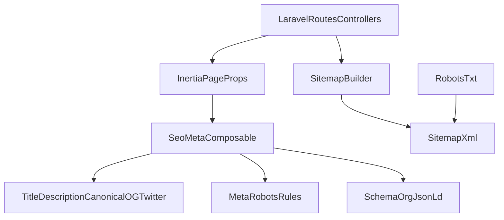

# План SEO-оптимизации для роста позиций

## Цели

- Устранить технические блокеры индексации и дубль-контент.
- Повысить релевантность сниппетов (title/description/OG/Twitter/Schema).
- Масштабировать SEO-настройки на все типы страниц без ручной рутины.

## Текущее состояние (по коду)

- SSR уже подключен: [wsl.localhost\Ubuntu\home\ksv180384\projects\afr\src\resources\js\ssr.js](\wsl.localhost\Ubuntu\home\ksv180384\projects\afr\src\resources\js\ssr.js), [wsl.localhost\Ubuntu\home\ksv180384\projects\afr\src\resources\js\ssr_admin.js](\wsl.localhost\Ubuntu\home\ksv180384\projects\afr\src\resources\js\ssr_admin.js).
- Базовые head-теги есть, но неполные: [wsl.localhost\Ubuntu\home\ksv180384\projects\afr\src\resources\views\app.blade.php](\wsl.localhost\Ubuntu\home\ksv180384\projects\afr\src\resources\views\app.blade.php).
- Sitemap реализован, но покрытие неполное и есть риск неверных URL: [wsl.localhost\Ubuntu\home\ksv180384\projects\afr\src\app\Services\App\Sitemap\SitemapService.php](\wsl.localhost\Ubuntu\home\ksv180384\projects\afr\src\app\Services\App\Sitemap\SitemapService.php), [wsl.localhost\Ubuntu\home\ksv180384\projects\afr\src\routes\web.php](\wsl.localhost\Ubuntu\home\ksv180384\projects\afr\src\routes\web.php).
- Есть страницы без полноценного `<Head>`: [wsl.localhost\Ubuntu\home\ksv180384\projects\afr\src\resources\js\App\Pages\Player\Player.vue](\wsl.localhost\Ubuntu\home\ksv180384\projects\afr\src\resources\js\App\Pages\Player\Player.vue), [wsl.localhost\Ubuntu\home\ksv180384\projects\afr\src\resources\js\App\Pages\LearningWrite\LearningWrite.vue](\wsl.localhost\Ubuntu\home\ksv180384\projects\afr\src\resources\js\App\Pages\LearningWrite\LearningWrite.vue), [wsl.localhost\Ubuntu\home\ksv180384\projects\afr\src\resources\js\App\Pages\CheckYourself\CheckYourself.vue](\wsl.localhost\Ubuntu\home\ksv180384\projects\afr\src\resources\js\App\Pages\CheckYourself\CheckYourself.vue).
- `robots.txt` требует актуализации: [wsl.localhost\Ubuntu\home\ksv180384\projects\afr\src\public\robots.txt](\wsl.localhost\Ubuntu\home\ksv180384\projects\afr\src\public\robots.txt).

## Архитектура целевого SEO-пайплайна

## Этап 1 (P0, критично)

- Нормализовать индексацию и каноникализацию URL:
  - Ввести `canonical` для всех индексируемых страниц.
  - Для search/filter/pagination URL определить правила `noindex,follow` или canonical на базовую версию.
  - Основные файлы: [wsl.localhost\Ubuntu\home\ksv180384\projects\afr\src\resources\views\app.blade.php](\wsl.localhost\Ubuntu\home\ksv180384\projects\afr\src\resources\views\app.blade.php), публичные страницы в [wsl.localhost\Ubuntu\home\ksv180384\projects\afr\src\resources\js\App\Pages](\wsl.localhost\Ubuntu\home\ksv180384\projects\afr\src\resources\js\App\Pages).
- Исправить и расширить sitemap:
  - Проверить генерацию URL для песен (исключить non-HTML маршруты из sitemap).
  - Добавить все SEO-значимые сущности (уроки, грамматика, словарь, статьи, ключевые листинги).
  - Файлы: [wsl.localhost\Ubuntu\home\ksv180384\projects\afr\src\app\Services\App\Sitemap\SitemapService.php](\wsl.localhost\Ubuntu\home\ksv180384\projects\afr\src\app\Services\App\Sitemap\SitemapService.php), [wsl.localhost\Ubuntu\home\ksv180384\projects\afr\src\app\Http\Controllers\App\SitemapController.php](\wsl.localhost\Ubuntu\home\ksv180384\projects\afr\src\app\Http\Controllers\App\SitemapController.php), [wsl.localhost\Ubuntu\home\ksv180384\projects\afr\src\routes\web.php](\wsl.localhost\Ubuntu\home\ksv180384\projects\afr\src\routes\web.php).
- Обновить robots:
  - Добавить `Sitemap:`.
  - Пересмотреть `Disallow`, чтобы не блокировать полезные секции.
  - Файл: [wsl.localhost\Ubuntu\home\ksv180384\projects\afr\src\public\robots.txt](\wsl.localhost\Ubuntu\home\ksv180384\projects\afr\src\public\robots.txt).

## Этап 2 (P1, высокий приоритет)

- Централизовать SEO-метаданные:
  - Создать единый composable/helper для `title`, `description`, `canonical`, `og:*`, `twitter:*`, `robots`.
  - Подключить на все публичные страницы, включая те, где сейчас нет `<Head>`.
  - Точки интеграции: [wsl.localhost\Ubuntu\home\ksv180384\projects\afr\src\resources\js\app.js](\wsl.localhost\Ubuntu\home\ksv180384\projects\afr\src\resources\js\app.js), [wsl.localhost\Ubuntu\home\ksv180384\projects\afr\src\resources\js\App\Pages](\wsl.localhost\Ubuntu\home\ksv180384\projects\afr\src\resources\js\App\Pages).
- Добавить структурированные данные JSON-LD:
  - Homepage (`WebSite`), статьи (`Article`), контентные карточки (например `CreativeWork`/`DefinedTerm` по типу страницы), breadcrumbs (`BreadcrumbList`).
  - Инъекция через page-level head.
- Внедрить Twitter Cards и завершить OG-профиль для повышения CTR.

## Этап 3 (P2, средний приоритет)

- Доработать on-page качество:
  - Проверка `h1` на страницах, `alt` для всех `img`, `loading="lazy"` для некритичных изображений.
  - Начать с: [wsl.localhost\Ubuntu\home\ksv180384\projects\afr\src\resources\js\App\Components\Header\Authentification\ProfileControl.vue](\wsl.localhost\Ubuntu\home\ksv180384\projects\afr\src\resources\js\App\Components\Header\Authentification\ProfileControl.vue).
- Усилить Core Web Vitals:
  - Приоритизация LCP-ресурсов (preload/fetchpriority), контроль JS payload, мониторинг web-vitals в аналитике.

## Контроль качества и KPI

- Технические проверки:
  - Валидность `sitemap.xml` и соответствие только индексируемым HTML URL.
  - Покрытие мета-тегов и canonical на 100% публичных страниц.
  - Наличие JSON-LD на ключевых шаблонах.
- SEO KPI (4-12 недель):
  - Рост количества корректно индексируемых страниц.
  - Рост CTR по брендовым и небрендовым запросам.
  - Снижение доли дублей и soft-404 в Search Console.
  - Улучшение LCP/INP/CLS по CrUX/GSC.

## Порядок внедрения

- Спринт 1: canonical + robots + sitemap fix/coverage.
- Спринт 2: централизованный SEO layer + OG/Twitter + JSON-LD.
- Спринт 3: URL slug migration + breadcrumbs + CWV hardening.
